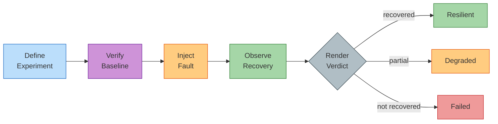

---
hide:
  - navigation
  - toc
---

# Operator Chaos

  

    Chaos engineering for Kubernetes operators. 
    Test reconciliation semantics, not just pod restarts.
  

  

    <a href="getting-started/installation/" class="md-button md-button--primary">Get Started</a>
    <a href="https://github.com/ugiordan/operator-chaos" class="md-button">GitHub</a>
  

## Why Operator Chaos?

Existing chaos tools (Krkn, Litmus, Chaos Mesh) test infrastructure resilience: kill a pod, verify it comes back. But Kubernetes operators manage complex resource graphs — Deployments, Services, ConfigMaps, CRDs — where the real question is:

**"When something breaks, does the operator put everything back the way it should be?"**

Operator Chaos answers this by testing reconciliation: verifying operators restore resources to their intended state after operator-semantic faults like CRD mutation, config drift, and RBAC revocation.

## How It Works

## Testing Fidelity

Operator Chaos is a test harness, not a fixed-fidelity tool. The fidelity of your chaos tests depends on the environment you point it at:

| Environment | Fidelity | What You Learn |
|-------------|----------|----------------|
| Fake client (fuzz mode) | Unit-level | Reconciler logic handles faults correctly |
| `kind` / `minikube` | Integration | Operator recovers resources on a real API server |
| Staging OpenShift | System | Operator works with real RBAC, webhooks, network policies |
| Production-like OCP | Production | Operator handles real workloads under real constraints |

The tool itself is lightweight (single static binary, ~20MB container image). What changes is the target: same experiments, same verdicts, different confidence levels. Start with fuzz tests during development, graduate to live cluster tests for release qualification.

## Offline vs Live Capabilities

Many `operator-chaos` commands work without any cluster connection:

| Command | Cluster Required? | What It Does |
|---------|-------------------|--------------|
| `operator-chaos validate` | No | Validates experiment and knowledge YAML syntax |
| `operator-chaos types` | No | Lists all available injection types |
| `operator-chaos init` | No | Scaffolds new experiment files |
| `operator-chaos preflight --local` | No | Validates knowledge YAML structure without cluster |
| `operator-chaos run` | Yes | Executes experiments against a live cluster |
| `operator-chaos suite` | Yes | Runs experiment suites against a live cluster |
| `operator-chaos preflight` (no `--local`) | Yes | Checks that declared resources exist on cluster |
| `operator-chaos clean` | Yes | Removes leftover chaos artifacts from cluster |

This means you can validate experiments, lint knowledge models, and scaffold new tests entirely offline, in CI without a cluster, or during development before you have access to a test environment.

## Four Usage Modes

| Mode | What It Tests | Cluster? | When to Use |
|------|--------------|----------|-------------|
| **CLI Experiments** | Full operator recovery on a live cluster | Yes | Pre-release validation, CI/CD |
| **SDK Middleware** | Operator behavior under API-level faults | Yes (or fake client) | Integration tests |
| **Fuzz Testing** | Reconciler correctness under random faults | No | Development, unit tests, CI |
| **Upgrade Testing** | Structural changes between operator versions | Yes | Release qualification, upgrade testing |

- :material-console: **CLI Experiments**

    ---

    Run structured chaos experiments against a live cluster. Orchestrates the full lifecycle: steady state, inject, observe, evaluate.

    [:octicons-arrow-right-24: CLI Quick Start](modes/cli.md)

- :material-code-braces: **SDK Middleware**

    ---

    Wrap a controller-runtime client with fault injection. No code changes to your reconciler needed.

    [:octicons-arrow-right-24: SDK Quick Start](modes/sdk.md)

- :material-shuffle-variant: **Fuzz Testing**

    ---

    Test reconciler correctness under random faults. No cluster needed — uses fake client.

    [:octicons-arrow-right-24: Fuzz Quick Start](modes/fuzz.md)

- :material-upload: **Upgrade Testing**

    ---

    Auto-generate chaos experiments from version diffs. Test CRD schema changes, resource ownership shifts, and dependency mutations.

    [:octicons-arrow-right-24: Upgrade Testing Guide](guides/upgrade-testing.md)

## Verdicts

Every experiment produces a structured verdict:

| Verdict | Meaning |
|---------|---------|
| **Resilient** | Operator restored all resources correctly within the timeout |
| **Degraded** | Operator recovered but with deviations from expected state |
| **Failed** | Operator did not recover within the timeout |
| **Inconclusive** | Baseline check failed, experiment could not run |
