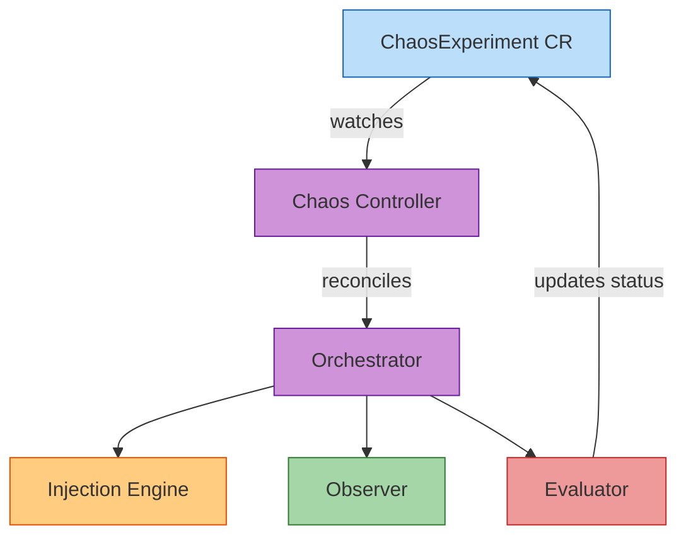
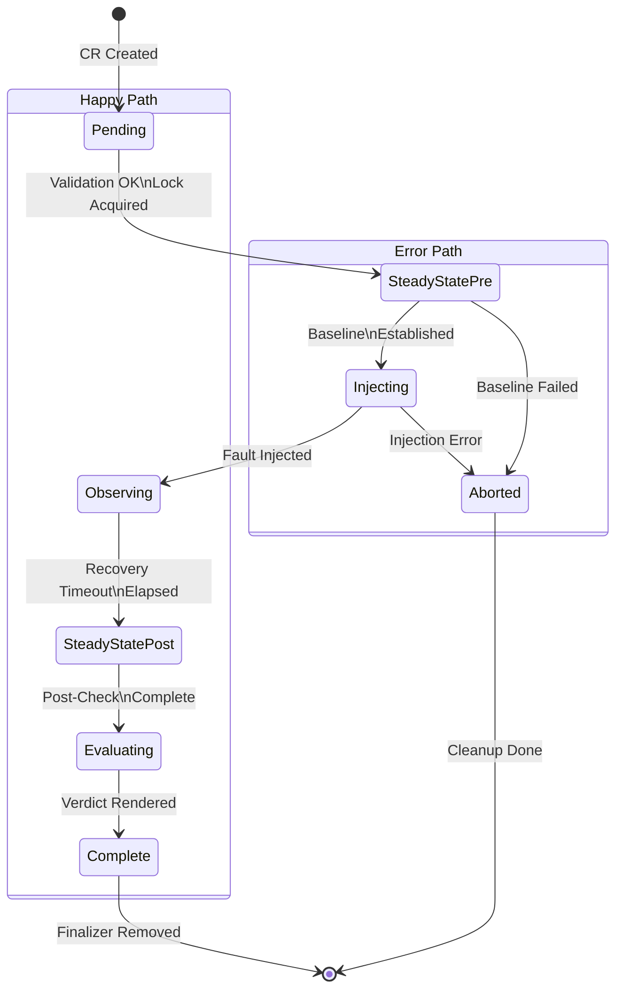

# Controller Mode

Controller mode runs chaos experiments as Kubernetes Custom Resources (CRs), managed by a dedicated reconciler. Instead of running one-shot experiments via the CLI, you create `ChaosExperiment` CRs that the controller drives through the experiment lifecycle.

## Why Controller Mode?

**CLI mode** (via `operator-chaos run`) is great for:

- Local development and testing
- CI/CD pipelines with ephemeral clusters
- One-off experiments with immediate results

**Controller mode** is better for:

- Continuous chaos testing in long-lived clusters
- Scheduled experiments via Kubernetes CronJobs
- Multi-tenant environments where teams manage their own experiments
- Integration with GitOps workflows (Argo CD, Flux)
- Auditable experiment history stored as CRs

In controller mode, experiments are **declarative**: you define the desired experiment as a CR, and the controller reconciles it to completion. The controller enforces safety mechanisms, manages distributed locking, and provides Kubernetes-native integrations (events, conditions, metrics).

## Architecture



The controller uses the **phase-per-reconcile** pattern: each reconcile loop advances the experiment by exactly one phase, updating `.status.phase` and `.status.conditions`. This ensures crash safety: if the controller restarts, it resumes from the last completed phase.

## Experiment Lifecycle

Each `ChaosExperiment` CR progresses through these phases:



| Phase | Description | Requeue Behavior |
|-------|-------------|------------------|
| `Pending` | Validates experiment spec, loads knowledge model, acquires distributed lock | Immediate requeue on validation success |
| `SteadyStatePre` | Runs pre-injection steady-state checks to establish baseline | Immediate requeue on check success; abort on failure |
| `Injecting` | Applies the fault (kills pod, mutates config, etc.) | Immediate requeue on successful injection |
| `Observing` | Waits for recovery timeout, monitors reconciliation | Requeues every 30s until timeout elapsed |
| `SteadyStatePost` | Runs post-recovery steady-state checks | Immediate requeue on check completion |
| `Evaluating` | Renders verdict based on findings | Immediate requeue after verdict set |
| `Complete` | Experiment finished successfully | Terminal state, no requeue |
| `Aborted` | Experiment aborted due to validation error or baseline failure | Terminal state, cleanup performed, no requeue |

**Status conditions** track progress:

- `SteadyStateEstablished`: Pre-check passed
- `FaultInjected`: Fault applied successfully
- `RecoveryObserved`: Recovery timeout elapsed
- `Complete`: Experiment finished

The controller emits Kubernetes **events** at each phase transition for observability.

## Prerequisites

1. **Kubernetes cluster** (v1.25+) or OpenShift (4.12+)
2. **cluster-admin RBAC** (controller needs permissions to create/delete/mutate arbitrary resources)
3. **ChaosExperiment CRD** installed (comes with `kubectl apply -k config/default`)
4. **Knowledge models** loaded (see [Knowledge Models](../guides/knowledge-models.md))

!!! warning "RBAC Permissions"
    The controller has broad RBAC permissions to support dynamic experiment targets. It can delete pods, mutate ConfigMaps, revoke RBAC bindings, and modify webhook configurations. Deploy in a dedicated namespace and review CRs before approval.

## Installation

### Deploy the Controller

```bash
# Clone the repository
git clone https://github.com/ugiordan/operator-chaos.git
cd operator-chaos

# Install CRD and controller
kubectl apply -k config/default
```

This creates:

- Namespace: `operator-chaos-system`
- CRD: `chaosexperiments.chaos.operatorchaos.io`
- ServiceAccount: `operator-chaos-controller`
- ClusterRole/ClusterRoleBinding: RBAC for controller
- Deployment: `operator-chaos-controller` (1 replica)

**Verify deployment:**

```bash
kubectl get deployment -n operator-chaos-system
# NAME                   READY   UP-TO-DATE   AVAILABLE   AGE
# operator-chaos-controller   1/1     1            1           30s

kubectl get crd chaosexperiments.chaos.operatorchaos.io
# NAME                                    CREATED AT
# chaosexperiments.chaos.operatorchaos.io   2024-03-30T12:00:00Z
```

### Load Knowledge Models

The controller needs knowledge models to validate experiments and perform steady-state checks. Mount them as a ConfigMap or volume:

**Option 1: ConfigMap**

```bash
# Create ConfigMap from knowledge/ directory
kubectl create configmap operator-knowledge \
  -n operator-chaos-system \
  --from-file=knowledge/

# Update controller deployment to mount ConfigMap
kubectl patch deployment operator-chaos-controller -n operator-chaos-system --type=json -p='[
  {
    "op": "add",
    "path": "/spec/template/spec/containers/0/args/-",
    "value": "--knowledge-dir=/knowledge"
  },
  {
    "op": "add",
    "path": "/spec/template/spec/volumes/-",
    "value": {"name": "knowledge", "configMap": {"name": "operator-knowledge"}}
  },
  {
    "op": "add",
    "path": "/spec/template/spec/containers/0/volumeMounts/-",
    "value": {"name": "knowledge", "mountPath": "/knowledge", "readOnly": true}
  }
]'
```

**Option 2: PersistentVolume**

```yaml
apiVersion: v1
kind: PersistentVolumeClaim
metadata:
  name: knowledge-pvc
  namespace: operator-chaos-system
spec:
  accessModes: [ReadOnlyMany]
  resources:
    requests:
      storage: 1Gi
---
# Update deployment to mount PVC at /knowledge
# Add --knowledge-dir=/knowledge to container args
```

**Verify knowledge models loaded:**

```bash
kubectl logs -n operator-chaos-system deployment/operator-chaos-controller | grep "Loaded knowledge"
# Loaded knowledge models: kserve, odh-model-controller, dashboard
```

## Your First Experiment

### ChaosExperiment CR Structure

```yaml
apiVersion: chaos.operatorchaos.io/v1alpha1
kind: ChaosExperiment
metadata:
  name: my-experiment
  namespace: my-namespace
spec:
  target:
    operator: odh-model-controller
    component: odh-model-controller
    resource: Deployment/odh-model-controller  # optional

  injection:
    type: PodKill
    parameters:
      labelSelector: control-plane=odh-model-controller
    count: 1
    ttl: "300s"

  hypothesis:
    description: "Pod kill should recover within 120s"
    recoveryTimeout: 120s

  steadyState:
    checks:
      - type: conditionTrue
        apiVersion: apps/v1
        kind: Deployment
        name: odh-model-controller
        namespace: opendatahub
        conditionType: Available
    timeout: "30s"

  blastRadius:
    maxPodsAffected: 1
    allowedNamespaces:
      - opendatahub
```

**Key fields:**

- **`target`**: Which operator/component to fault
- **`injection`**: Fault type and parameters (see [Failure Modes](../failure-modes/index.md))
- **`hypothesis`**: Expected behavior and recovery timeout
- **`steadyState`**: Checks to run pre/post injection
- **`blastRadius`**: Safety constraints

### Example: PodKill Experiment

```yaml
apiVersion: chaos.operatorchaos.io/v1alpha1
kind: ChaosExperiment
metadata:
  name: odh-model-controller-pod-kill
  namespace: operator-chaos-experiments
spec:
  target:
    operator: odh-model-controller
    component: odh-model-controller

  injection:
    type: PodKill
    parameters:
      labelSelector: control-plane=odh-model-controller
    count: 1

  hypothesis:
    description: >-
      When the odh-model-controller pod is killed, Kubernetes should
      recreate it within the recovery timeout and the controller should
      resume reconciling InferenceService resources without data loss.
    recoveryTimeout: 120s

  steadyState:
    checks:
      - type: conditionTrue
        apiVersion: apps/v1
        kind: Deployment
        name: odh-model-controller
        namespace: opendatahub
        conditionType: Available
    timeout: "30s"

  blastRadius:
    maxPodsAffected: 1
    allowedNamespaces:
      - opendatahub
```

**Apply the experiment:**

```bash
kubectl apply -f experiment.yaml
```

**Watch progress:**

```bash
kubectl get chaosexperiment odh-model-controller-pod-kill -w
# NAME                              PHASE           VERDICT   TYPE      TARGET                 AGE
# odh-model-controller-pod-kill     Pending                   PodKill   odh-model-controller   1s
# odh-model-controller-pod-kill     SteadyStatePre            PodKill   odh-model-controller   2s
# odh-model-controller-pod-kill     Injecting                 PodKill   odh-model-controller   5s
# odh-model-controller-pod-kill     Observing                 PodKill   odh-model-controller   6s
# odh-model-controller-pod-kill     SteadyStatePost           PodKill   odh-model-controller   126s
# odh-model-controller-pod-kill     Evaluating                PodKill   odh-model-controller   127s
# odh-model-controller-pod-kill     Complete        Resilient PodKill   odh-model-controller   128s
```

## Cleanup

### Delete a Single Experiment

```bash
kubectl delete chaosexperiment my-experiment
```

This triggers finalizer cleanup, which reverts the fault if still active.

### Uninstall the Controller

```bash
# Delete all experiments first (ensures cleanup runs)
kubectl delete chaosexperiments --all -A

# Uninstall controller and CRD
kubectl delete -k config/default
```

!!! warning "CRD Deletion"
    Deleting the CRD deletes all ChaosExperiment CRs immediately, **bypassing finalizers**. Always delete experiments individually to ensure faults are reverted.

## Next Steps

- See [Controller Advanced Guide](../guides/controller-advanced.md) for CronJobs, GitOps, safety mechanisms, and detailed status fields
- Learn about [Knowledge Models](../guides/knowledge-models.md) to define operator semantics
- See [Failure Modes](../failure-modes/index.md) for all available fault types
- Read [CI Integration Guide](../guides/ci-integration.md) for pipeline integration
